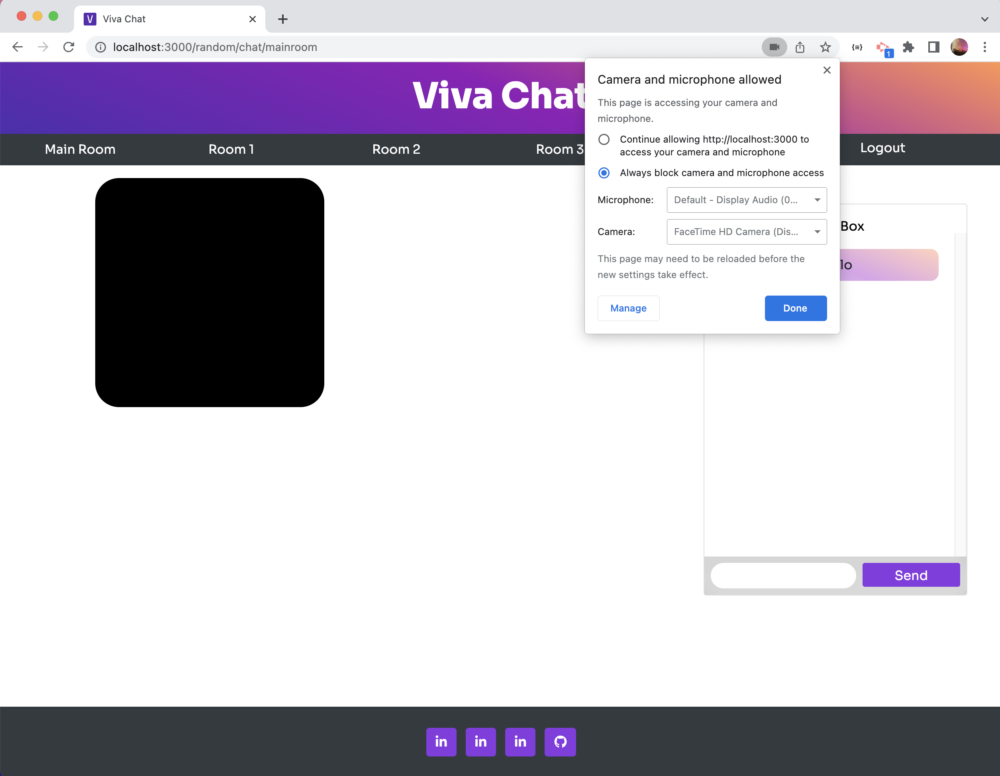

# Random Chat

## Description

This application allows a user to videochat/instant message with a friend, or join randomized rooms to make new friends. 

In this project, we learned how data is passed over the internet, how to initiate connections between browsers, how to create user sessions, how to protect routes so that only authenticated users have access, and how to use a templating language (handlebars). 

We wanted to use a technology we had not yet talked about in class, so we decided on WebRTC(peer.js) and WebSockets(socket.io). 

If you would like to try the application out, please visit the link below. 

Deployed Application: https://vivachat.herokuapp.com/

## Table of Contents

- [Installation](#installation)
- [Usage](#usage)
- [Credits](#credits)
- [License](#license)

## Installation

To get started in the development environment, follow the following steps:
 1. Clone this the repo found at this [link](https://github.com/brownj47/random-video-chat)
 2. Open a terminal and navigate to the root directory of the project
 3. Run 'npm i' to get the project dependecies
 4. Download and Sign up for MySQL by following this guide: https://coding-boot-camp.github.io/full-stack/mysql/mysql-installation-guide
 5. Rename .env.EXAMPLE to '.env', and fill in the DB_PASSWORD= '' with the password you created for MySQL, fill the session SESSION_SECRET= '' with a random string you can remember
 6. Open a terminal shell and run 'mysql -u root -p' and tehn enter your password to start a MySQL instance on your computer
 7. Run 'SOURCE db/schema.sql;' to create the database and then 'exit;'
 8. Run 'node seeds/seeds.js' to seed the database with users
 9. Run 'node index.js' to start the server
 10. Open a browser of your choice and visit http://localhost:3000/ to start the application. 

## Usage

To use our application, either set it up locally using the above installation guide, or follow the [link](https://vivachat.herokuapp.com) above to access the deployed app. 
Then, create an account. You will be redirected to the main chat room, and can switch rooms from there by clicking the buttons in the navbar. 
You will need to allow the browser to access your video.
To see your video, open a new tab in a private window, create another account and then join the room(Main, Room 1, Room 2, Room 3) you are in on the other browser. There should now be two video streams on your page. 

If you opt to use the online version, you can have a friend join the chat rather than using a separate browser. All they need to do is login and join the room you are in. 

The Room Roulette button will place you in a random room, and the next user to join Random Roulette should be paired with you. 

## Credits

Created by:
- [Gabriel Warner](https://github.com/GabrielWarner)
- [Zhao-ming Zhong](https://github.com/zmzhong1)
- [Justus Brown](https://github.com/brownj47)

We used these resources to inform our work:
- [How To Create A Video Chat App With WebRTC -- Web Dev Simplified](https://www.youtube.com/watch?v=DvlyzDZDEq4)
- [Peer JS Docs](https://peerjs.com/docs/)
- [Socket.io Docs](https://socket.io/docs/v4/how-it-works/)

## License

MIT License

Copyright (c) 2022 Justus Brown, Gabriel Warner, Zhao-Ming Zhong

Permission is hereby granted, free of charge, to any person obtaining a copy
of this software and associated documentation files (the "Software"), to deal
in the Software without restriction, including without limitation the rights
to use, copy, modify, merge, publish, distribute, sublicense, and/or sell
copies of the Software, and to permit persons to whom the Software is
furnished to do so, subject to the following conditions:

The above copyright notice and this permission notice shall be included in all
copies or substantial portions of the Software.

THE SOFTWARE IS PROVIDED "AS IS", WITHOUT WARRANTY OF ANY KIND, EXPRESS OR
IMPLIED, INCLUDING BUT NOT LIMITED TO THE WARRANTIES OF MERCHANTABILITY,
FITNESS FOR A PARTICULAR PURPOSE AND NONINFRINGEMENT. IN NO EVENT SHALL THE
AUTHORS OR COPYRIGHT HOLDERS BE LIABLE FOR ANY CLAIM, DAMAGES OR OTHER
LIABILITY, WHETHER IN AN ACTION OF CONTRACT, TORT OR OTHERWISE, ARISING FROM,
OUT OF OR IN CONNECTION WITH THE SOFTWARE OR THE USE OR OTHER DEALINGS IN THE
SOFTWARE.
